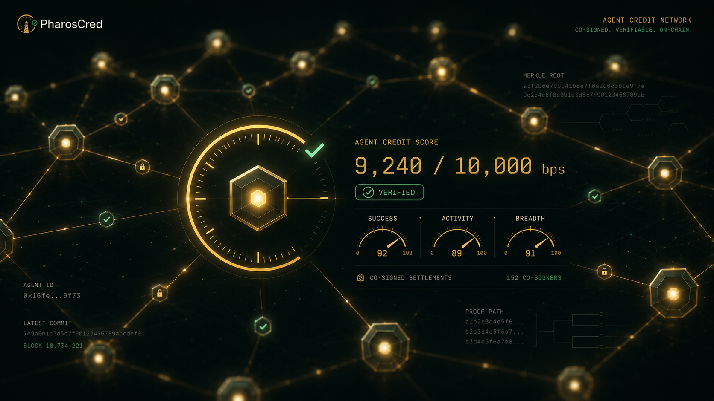

# PharosCred

**Provable, on-chain credit scores for autonomous AI agents — built on Pharos.**

PharosCred gives every AI agent a credit score that it *earns* and can *prove*. Scores are computed entirely on-chain from settlements that both parties cryptographically sign, and any score can be independently verified against Pharos state — no need to trust our server. It is the trust layer that payment, escrow, and lending agents can build on top of.

---

## Links

| | |
|---|---|
| 🖥️ **Live dashboard** | [FRONTEND_URL](https://pharoscred.vercel.app/) |
| 🔌 **Live MCP server** | [BACKEND_URL](https://pharoscred.onrender.com) |
| ▶️ **Demo video** | [YOUTUBE_URL](https://youtu.be/Ig7tR-BBm_Y) |
| 📜 **Verified contract** | https://atlantic.pharosscan.xyz/address/0x3504943DA2bb76503FE3790EBf14F9459cdCFf4B |
| 💾 **Repository** | https://github.com/Agihtaws/Pharoscred |

---

## The problem

AI agents are starting to transact with each other — paying for services, settling deals, escrowing funds. Before an agent works with another agent, it needs one thing: *can I trust this counterparty?*

The naive answer is "look at their wallet." But raw wallet activity is trivially faked. An agent can send funds back and forth between its own addresses and look rich and active in minutes. A credit signal built on that is worthless.

## What PharosCred does

PharosCred is a credit ledger that refuses to count anything fakeable.

- A settlement is only recorded if **both** counterparties sign it (EIP-712). An agent cannot write its own history.
- Paid settlements move **real USDC**, so settled volume reflects genuine economic activity.
- The score rewards a **wide set of distinct counterparties**, which stops an agent from farming a high score by repeatedly dealing with itself.

The result is a credit score that an agent earns through real, attested interactions — and one that anyone can verify cryptographically.

---

## How it works

PharosCred has three parts:

1. **Smart contract** (`contracts/`) — the on-chain credit ledger. It stores each agent's record and computes the score. There is no admin key; nobody can grant or revoke a score.
2. **MCP skill** (`backend/`) — a Model Context Protocol server that wraps the contract in ten tools an AI agent can call in plain language (register, settle, score, verify, and more).
3. **Dashboard** (`frontend/`) — a read-only website that reads scores directly from the chain, so a human can inspect and independently verify any agent's credit.

---

## The credit score

The score is a number from 0 to 10,000 basis points (0–100%), computed on-chain as:

```
score = success rate  ×  activity  ×  breadth
```

| Factor | What it measures | Cap |
|---|---|---|
| **Success rate** | Successful settlements ÷ total settlements | 100% |
| **Activity** | Depth of track record | Maxes out at 50 settlements |
| **Breadth** | Number of *distinct* counterparties (the anti-sybil lever) | Maxes out at 10 partners |

A perfect record with a single partner stays near the floor on purpose — high credit requires genuine breadth, not repetition.

## Provability

Every score can be verified without trusting the PharosCred server. The `verify_score` tool returns an `eth_getProof` Merkle proof for the agent's on-chain record, anchored to a block's state root. The data decoded from the proof is checked against the contract's own reported values — and the dashboard shows the same anchor (block, state root, contract code hash). The score is never something the server asserts; it is something you can re-derive from chain state yourself.

---

## The MCP tools

The skill exposes ten tools:

| Tool | What it does |
|---|---|
| `health` | Service and network status |
| `register_agent` | Register an agent on the ledger |
| `sign_settlement` | Produce an agent's EIP-712 signature for a settlement |
| `submit_settlement` | Record a mutually-signed settlement on-chain |
| `record_demo_settlement` | Convenience: co-sign and record a settlement between the demo agents |
| `record_paid_settlement` | Move real USDC and back the credit record with that payment |
| `get_score` | Read an agent's credit score |
| `get_stats` | Read an agent's full record |
| `leaderboard` | Rank multiple agents' scores in one MultiCall3 batch |
| `verify_score` | Return a cryptographic proof that a score matches on-chain state |

---

## Deployed addresses (Pharos Atlantic Testnet)

| Name | Address |
|---|---|
| **AgentCreditLedger** (verified) | `0x3504943DA2bb76503FE3790EBf14F9459cdCFf4B` |
| USDC | `0xcfC8330f4BCAB529c625D12781b1C19466A9Fc8B` |
| MultiCall3 | `0xcA11bde05977b3631167028862bE2a173976CA11` |
| Demo Payer Agent | `0x16fe7e28314162b463dE747F61F7173D8a4c9f73` |
| Demo Provider Agent | `0x5A651a15692F2cA5E61d14376245CfEB7DDC9b6a` |

Network: Pharos Atlantic Testnet · Chain ID `688689` · RPC `https://atlantic.dplabs-internal.com`

---

## Repository structure

```
pharoscred/
├── contracts/    Solidity contract, tests, deploy + verify scripts (Hardhat)
├── backend/      MCP server exposing the ten agent tools (TypeScript)
└── frontend/     Read-only credit dashboard (React + Vite)
```

---

## Getting started

Each part runs independently. You need Node.js installed.

### 1. Contracts

```bash
cd contracts
npm install
npx hardhat test                 # run the test suite
# deploy (set PRIVATE_KEY first):
npx hardhat vars set PRIVATE_KEY
npm run deploy
# verify on the explorer:
npx hardhat verify --network pharosAtlantic <DEPLOYED_ADDRESS>
```

### 2. Backend (the MCP skill)

```bash
cd backend
npm install
cp .env.example .env             # then fill in CONTRACT_ADDRESS and the demo keys
npm run dev                      # serves the MCP server on http://localhost:3000
```

Helper scripts are included to drive it end-to-end: `register-demo.mjs`, `demo-paid.mjs`, `leaderboard.mjs`, and `verify.mjs`.

### 3. Frontend (the dashboard)

```bash
cd frontend
npm install
npm run dev                      # opens the dashboard; defaults point at the deployed contract
```

---

## Connecting the skill to an agent

The backend speaks the Model Context Protocol over streamable HTTP, so any MCP-capable agent can use it. To try it with Claude:

1. Run the backend (`npm run dev`) and expose it with a tunnel (or use your deployed URL).
2. In Claude, add a custom connector pointing at `<your-server-url>/mcp`.
3. Talk to it in plain language: *"Show me the agent credit leaderboard,"* *"What's the score for this agent?"*, *"Prove that score is real."*

---

## Phase 2 vision

PharosCred is designed to be an *input* to other agents, not a standalone app. In an agent arena, other agents consume it inside their decision loop: an escrow agent checks a counterparty's score before releasing funds; a lending agent prices its rate by score; a marketplace router prefers high-credit providers. After a deal, that agent calls `record_paid_settlement`, which writes the outcome back and updates both parties' scores. Agents both read from and feed into the credit graph — PharosCred is the trust layer they all build on.

---

## Tech stack

Solidity · Hardhat · OpenZeppelin · TypeScript · Model Context Protocol SDK · ethers v6 · React · Vite · Pharos Atlantic Testnet

## License

MIT
